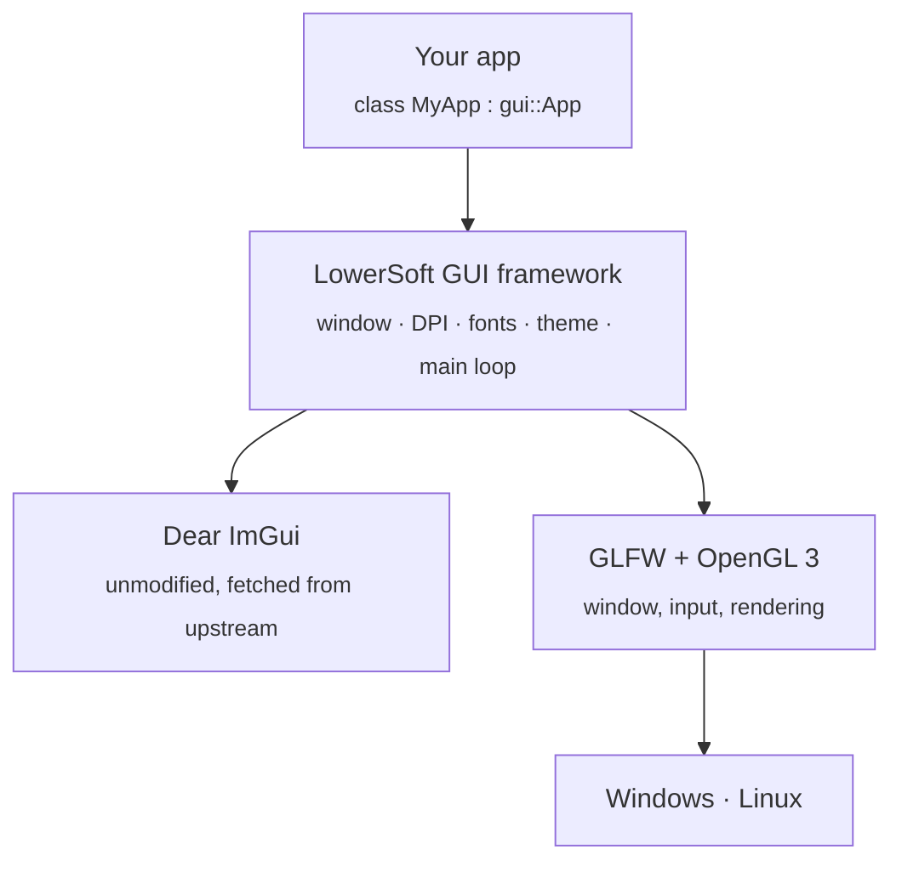

<div align="center">
  
</div>
</br>
<div align="center">

  
  
  

</div>

LowerSoft GUI is a cross-platform user interface foundation for *Windows* and *Linux*, built on top of . Rather than maintaining a fork, it integrates with the upstream **ImGui API directly**, which keeps it easy to *update* and *free of divergence* from the original library.<br>
<sub>It serves as the common GUI layer for LowerSoft's commercial products and is under active development.</sub>

<hr>
<div align="center">
  <a href="#usage">Usage</a> · 
  <a href="#how-it-works-explained-for-just-project-infrastructure">How it Works</a> · 
  <a href="#contact">Contact</a> ·
  <a href="#credits">Credits</a> ·
  <a href="#contribute">Contribute</a> ·
  <a href="#license">License</a>
</div>
<hr>

### Usage
Everything below works the same on Windows (MSYS2 UCRT64) and Linux. No Visual Studio needed(btw).
#### 1.1 Get the tools
| Platform | One-time setup |
|-|---|
| Windows | Install [MSYS2](https://www.msys2.org), open the **MSYS2 UCRT64** terminal (not "MSYS"), then run `./scripts/setup-msys2.sh` |
| Linux (Arch Linux, Ubuntu, Debian and Fedora) | `./scripts/setup-linux.sh` |

The scripts install CMake, Ninja, a compiler and the OpenGL/X11 headers. Dear ImGui and GLFW are fetched automatically on the first configure, so there is nothing else to install.

#### 1.2 Build and run
```bash
git clone https://github.com/lowersoft/gui.git && cd gui
./build.sh release --run
```
`build.sh` takes `debug`, `release`, `clang-debug` or `clang-release`. The binaries land in `build/<preset>/bin/`. Prefer plain CMake? <3
```bash
cmake --preset release
cmake --build --preset release
```
> Debug builds read `conf/` straight from the source tree, so theme edits show up instantly. Release builds use the copy next to the executable.

#### 1.3 Write your first app
Derive from `gui::App`, override what you need, and write plain Dear ImGui inside `OnGui()`. There is no wrapper API to learn(we suggest ImGui Docs, these docs realy enough for this infrastructure; no needs to learn "ImGui Backend". It's realy will be easier than without infra).
```cpp
#include "gui/app.h"

class MyApp : public gui::App {
    void OnGui() override {
        ImGui::Begin("Hello");
        if (ImGui::Button("Quit")) RequestClose();
        ImGui::End();
    }
};

GUI_MAIN(MyApp, "My App", 1280, 720)
```
Register it in `examples/<name>/CMakeLists.txt` (one line) and add the folder to the root `CMakeLists.txt`:
```cmake
gui_add_app(myapp main.cpp)
```
Other hooks: `OnInit`, `OnUpdate`, `OnShutdown`. Window options such as docking, viewports, vsync and fonts live in `gui::AppConfig`. For a full tour, see the [framework reference](docs/framework.md); `examples/hello` and `examples/file_transfer` are good starting points.

#### 1.4 Theming
The whole look is driven by [`conf/theme.ini`](conf/theme.ini): a palette, every ImGui color and the style metrics. Save the file and the running app updates within half a second. Ready-made themes are in `conf/themes/`.
```cpp
SetTheme("conf/themes/light.ini");   // switch at runtime ("i'm not using light theme btw ;)")
```
Prefer a GUI? The `hello` example has a built-in Style Editor and a live text editor for the theme file.

#### 1.5 Handy options
| CMake option | Default | What it does |
|---|---|---|
| `GUI_BUILD_EXAMPLES` | `ON` | Build the example apps |
| `GUI_STATIC_RUNTIME` | `ON` | MinGW: no runtime DLLs to ship |
| `GUI_HIDE_CONSOLE` | `OFF` | Windows: no console window next to the app |

Pass them with `-D`, e.g. `cmake --preset release -DGUI_HIDE_CONSOLE=ON`.

Something broke? Check that you are in the **UCRT64** shell on Windows, delete `build/` and try again. Still stuck? [Open an issue](https://github.com/lowersoft/gui/issues).

### How it Works (explained for just project infrastructure)
The idea is simple: **keep Dear ImGui untouched and put a thin, boring layer around it.** The layer handles everything you'd otherwise copy-paste into every project (window, OpenGL, DPI, fonts, theme, build) and then gets out of your way.

#### 2.1 The big picture

Your code only ever talks to `gui::App` and plain `ImGui::`. Nothing else leaks upward.

#### 2.2 Repo layout
```
gui/
├── cmake/        Dependencies (ImGui, GLFW) and compiler warning settings
├── conf/         theme.ini + ready-made themes in themes/
├── framework/    The layer itself: App, Theme, file dialogs
├── examples/     hello, file_transfer: copy one to start your own
├── scripts/      One-time tool setup for MSYS2 and Linux
├── docs/         Framework reference
└── build.sh      Configure + build (+ run) in one command
```

#### 2.3 Dependencies: fetched, not forked
`cmake/Dependencies.cmake` pulls **Dear ImGui** (`v1.92.9-docking`) and **GLFW** (`3.4`) with CMake's `FetchContent` on the first configure. Nothing is vendored, nothing is patched.

> Want a newer ImGui? Change the tag in that file. That's the whole upgrade procedure.

#### 2.4 Application lifecycle
`GUI_MAIN(MyApp, "Title", w, h)` generates `main()`, which creates your app and calls `App::Run()`. From there the framework owns the loop:
```
Run()
 ├─ create window + OpenGL context, scale for monitor DPI
 ├─ create ImGui context, load font, load theme
 ├─ OnInit()                      ← your setup
 └─ every frame
     ├─ poll events
     ├─ apply pending theme changes   (always between frames, never mid-frame)
     ├─ NewFrame → OnUpdate(dt) → OnGui()   ← your code
     └─ render + swap buffers
 └─ OnShutdown()                  ← your cleanup
```
The window is DPI-aware out of the box: fonts and style sizes are scaled once from the monitor's content scale, so the same build looks right on a 1080p laptop and a 4K desktop.

#### 2.5 Theming
`conf/theme.ini` is parsed into a `gui::Theme`, which is written into ImGui's style before a frame starts:
```
theme.ini ──parse──▶ gui::Theme ──apply (+DPI scale)──▶ ImGui style
    ▲                                                        
    └── file timestamp polled every 0.5 s → hot reload
```
- A theme file can name a built-in `base` (dark, light, classic) and only override what it wants. Everything it skips falls back to the base.
- Bad lines never crash anything: they are skipped and reported as warnings with line numbers.
- Config lookup order: source tree (Debug builds), then next to the executable, then the working directory.
- `SetTheme()`, `ReloadTheme()` and `PreviewThemeText()` only *queue* a change; the next frame boundary applies it. This is why you can switch themes from inside `OnGui()` safely.

The file format is documented at the top of [`conf/theme.ini`](conf/theme.ini).

#### 2.6 Build system
| Piece | What it does |
|---|---|
| **CMake + Ninja** | Single build description for every platform. No IDE project files in the repo. |
| **`CMakePresets.json`** | `debug`, `release`, `clang-debug`, `clang-release`, so everybody builds the same way. |
| **`gui_add_app()`** | One line per app: links the framework, applies warnings, copies `conf/` next to the executable and, on MinGW, links the runtime statically so you can ship a single `.exe`. |
| **`build.sh`** | Checks you're in the right shell (UCRT64 on Windows) and that the tools exist, then configures, builds and optionally runs. |

#### 2.7 Continuous integration
Every push builds on GitHub Actions: **Linux** (GCC and Clang) and **Windows** (MSYS2 UCRT64 / GCC). **Windows MSVC** and **macOS** are in the matrix too, but flagged *experimental*: they're expected to work, just not guaranteed yet. The workflow lives in [`.github/workflows`](.github/workflows/cmake-multi-platform.yml).

#### 2.8 Extending it
Want more than ImGui gives you? Add it to `framework/` and expose it through a small header, the way the native file dialogs (`gui/file_dialog.h`) are done: no extra libraries, one function call from your app. For the full API, see the [framework reference](docs/framework.md).

### Contact
Not sure where to start? Pick the row that matches your situation, so your message reaches the right people on the first try.
| I want to... | Reach us via |
|----|--|
| Ask about **licensing or copyright** | [info@lowersoft.com](mailto:info@lowersoft.com) |
| Follow up on a **repo issue** that hasn't had a reply | [support@lowersoft.com](mailto:support@lowersoft.com) |
| Report a problem with the **GUI of a LowerSoft product** I own | Open a ticket on [lowersoft.com](https://lowersoft.com) |
| Learn what the GUI framework brings to our **products** | Live chat on [lowersoft.com](https://lowersoft.com), no sign-in needed |

#### A few details
- **Licensing & copyright** (`info@`): using the framework in your own project, redistribution, attribution or anything legal-sounding. If in doubt, ask before you ship.
- **Unanswered issues** (`support@`): please open a [GitHub issue](https://github.com/lowersoft/gui/issues) first. It keeps the answer public and useful for everyone. If it has been quiet for a while, send us a short mail with the issue link and we'll pick it up.
- **Product tickets**: if a LowerSoft product you bought has a GUI problem (layout, theme, crashes in the interface), a ticket is the fastest route because it is tied to your account and product version. Include a screenshot and your OS.
- **Live chat**: it connects you straight to our customer relations team, no account required. It is the best place to ask how the shared GUI layer benefits our products: consistency, theming, cross-platform support and update cadence.

> **Heads up:** this is a framework repo, not a product helpdesk. Product questions go to a ticket, framework bugs go to GitHub issues. Everything else is welcome in the table above.

### Credits
Two developers, one shared goal: a GUI layer that is pleasant to build with. Every part of this project is shaped by our own time and effort, and we're not planning to slow down. 💙

#### Standing on the shoulders of

This project exists thanks to great open source work. Please go give these a star:

| Project | What we use it for | License |
|---|---|---|
| [Dear ImGui](https://github.com/ocornut/imgui) by Omar Cornut | The entire UI, used unmodified | MIT |
| [GLFW](https://github.com/glfw/glfw) | Windows, input and OpenGL contexts | zlib/libpng |
| [CMake](https://cmake.org) and [Ninja](https://ninja-build.org) | Build system | BSD-3-Clause / Apache-2.0 |
| [MSYS2](https://www.msys2.org) | The Windows toolchain, no Visual Studio needed | Various |

#### Contributors

Everyone who has helped along the way shows up here automatically:

<a href="https://github.com/lowersoft/gui/graphs/contributors">
  
</a>

Want to see your face here? Head over to [Contribute](#contribute).

### Contribute
Our goal is to make using Dear ImGui easier, tidier and more reliable for everyone. Any contribution that moves the project in that direction is welcome, from a one-character typo fix to a new feature. Pull requests and forks are always appreciated.

| I want to... | Do this |
|---|---|
| Report a bug | Open an [issue](https://github.com/lowersoft/gui/issues) with the steps to reproduce, the expected result and the actual result |
| Suggest an idea | Open an [issue](https://github.com/lowersoft/gui/issues); rough ideas are fine |
| Fix or add something | Fork the repo and send a pull request |
| Improve the documentation | Send a pull request; wording, missing steps and typos are all welcome |
| Test on my platform | Run the examples and report the result, especially on the experimental platforms (MSVC, macOS) |

#### Sending a pull request
1. **Fork** the repository and create a branch from `main` (for example `fix/theme-warning` or `feat/drag-drop`).
2. **Build** it with `./build.sh debug` and make sure it compiles without warnings.
3. **Test** it by running an example that exercises your change.
4. **Open the pull request** and describe what changed and why. Screenshots help for UI changes.

For larger changes, please open an issue first so we can agree on the direction before you invest the time.

#### Guidelines
- C++17 with 4-space indentation and no tabs.
- Code, comments and documentation are written in English.
- Public API carries short Doxygen comments; inline comments explain *why*, not *what*.
- Dear ImGui stays untouched. The framework remains a thin layer on top of the upstream API.
- Themes use the INI format documented in [`conf/theme.ini`](conf/theme.ini).
- Commit messages start with a short summary line, followed by a brief explanation when the reasoning is not obvious.

Questions about contributing? See [Contact](#contact).

### License
LowerSoft GUI is released under the **[MIT License](LICENSE)**. You are free to use, copy, modify, merge, publish, distribute, sublicense and sell copies of the software, including in commercial projects, as long as the copyright notice and the license text are included in all copies or substantial portions of it.

The software is provided "as is", without warranty of any kind.

#### Third-party software
This repository does not contain or modify the source code of its dependencies. They are downloaded at configure time and remain under their own licenses:

| Component | License |
|---|---|
| [Dear ImGui](https://github.com/ocornut/imgui) | MIT |
| [GLFW](https://github.com/glfw/glfw) | zlib/libpng |

When you distribute an application built with this framework, keep the license notices of these components with it.

Questions about licensing or copyright? See [Contact](#contact).

<div align="center">
  Best regards, <b>LowerSoft Team</b>. <br>
  
</div>
